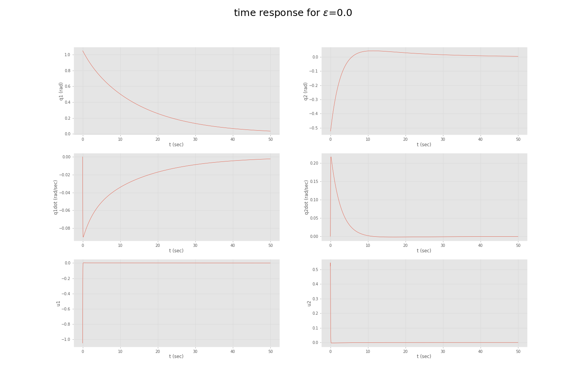
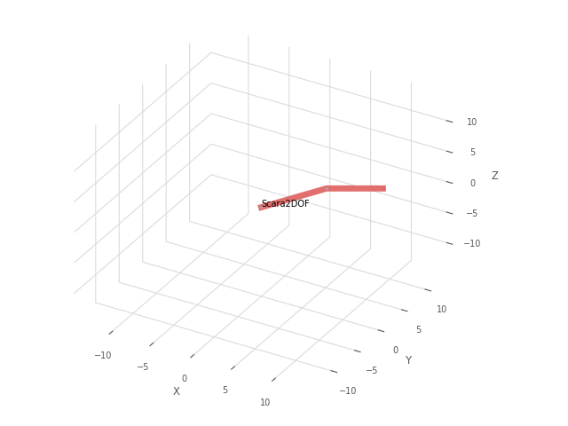

# ENPM667 Project 1
# An Optimal Control Approach to Robust Control of Robot Manipulators
## Group of 2:
* Yashveer Jain : 119252864
* Mayank Sharma : 119203859

## Overview:
With Uncertainty in state dynamics and input matrix, for Robot Manipulator, the controlling become difficult and there different ways to design controller, either using Robust Control Approach or Optimal Control Approach. Here we're implementing the paper which uses Optimal Control Approach i.e LQR controller to solve the Robust Control problem of Robot Manipulator.

## Results for $\epsilon = 0$
### Plot


### Animation



## Install dependencies
```
pip install -r requirements.txt
```

## Run
```
python3 code/scara.py <path/to/store/result image file> <epsilon value b/w (0,1)>
```
* example:
```
python3 code/scara.py results/e_0.png 0
```
### Note:
* If path argument are not given, then script will exit.
* By default 
    - epsilon = 0 if epsilon argument is not given.
    - animation output = `True`, and need to set it to `False` manually in line 228 in the [file](code/scara.py), if animation is not needed.

## Interactive code
Interactive code can be found [here](code/interative_scara.ipynb)


## Reference:
* An optimal control paper
* https://automaticaddison.com/linear-quadratic-regulator-lqr-with-python-code-example/

